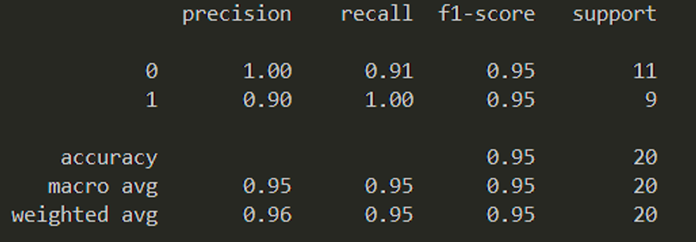
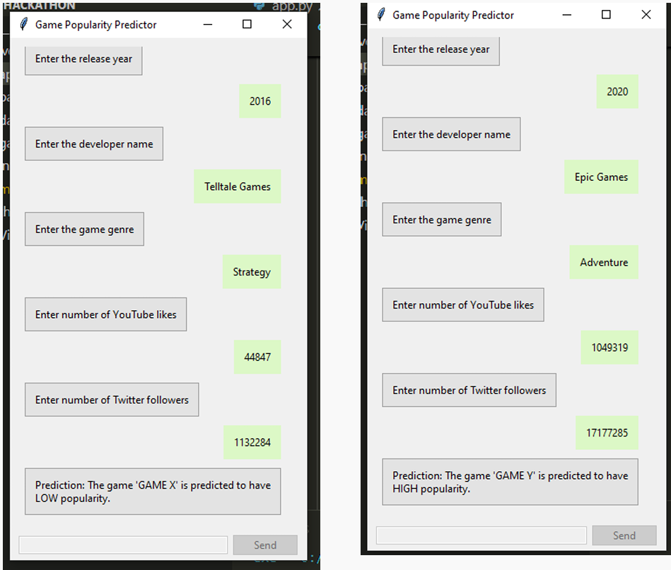

# Video Game Popularity Prediction

Here is the project we came up with for the 2024 **Spooktacular Solutions** Hackathon organized by the **Microsoft Ignite Students Club**. This project predicts the popularity of newly released video games using a machine learning model. By considering various parameters, such as game developer, genre, rating, downloads, and social media metrics, we can help developers and investors forecast potential success in the gaming market.

## Table of Contents 
- [Video Game Popularity Prediction](#video-game-popularity-prediction)
  - [Table of Contents](#table-of-contents)
  - [Dataset](#dataset)
  - [Training the Model](#training-the-model)
    - [Model Training Workflow](#model-training-workflow)
  - [Results](#results)
  - [How to Use](#how-to-use)

---

## Dataset

We created a synthetic dataset using ChatGPT with 100 real-world inspired entries, encompassing a variety of developers and genres. Each entry includes the following features:

- **Developer**  
- **Genre**  
- **Rating** (out of 5 stars)  
- **Downloads**  
- **Twitter Followers** of the developer  
- **YouTube Trailer Likes**  
- **Year of Release**  
- **Popularity Score**  
- **Popularity Status**  

The dataset was engineered to reflect realistic patterns in popularity, based on factors like social media presence and developer reputation.

*Sample of the Dataset Structure:*
| Developer       | Genre       | Rating | Downloads | Twitter Followers | YouTube Trailer Likes | Year of Release | Popularity Score | Popularity Status |
|-----------------|-------------|--------|-----------|--------------------|---------------|-----------------|------------------|--------------------|
| Epic Games      | Action      | 4.5    | 1,000,000 | 2,000,000         | 1,500,000     | 2022            | 87               | Great             |
| Nintendo        | Adventure   | 4.7    | 2,000,000 | 3,500,000         | 2,100,000     | 2021            | 92               | Great             |


## Training the Model

We built a machine learning model using a **Support Vector Classifier (SVC)** to predict the popularity status of a game as either "High" or "Low." The training process includes:

- Splitting the data with an 80-20 train-test ratio
- Using a median threshold on the popularity score to classify games
  - **1**: High Popularity  
  - **0**: Low Popularity  

### Model Training Workflow
1. **Data Preprocessing**: Categorical and numerical features were classified.
2. **Training & Testing**: Model training uses 80% of the data, while testing is conducted with the remaining 20%.
3. **Accuracy**: The model achieved a weighted average accuracy of 96%.

*Classification Report:*  


## Results

After running the `app.py` file, which contains the UI for interaction, the model outputs either "High Popularity" or "Low Popularity" predictions for inputted values.

*Output:*  


The developer popularity ranking used in this model includes (ordered by popularity):

1. Epic Games
2. Nintendo
3. Sony Interactive
4. Ubisoft
5. Bethesda
6. Electronic Arts
7. Activision
8. Rockstar Games
9. Blizzard Entertainment
10. Capcom
11. Square Enix
12. Valve
13. Bandai Namco
14. CD Projekt
15. Telltale Games

## How to Use

1. Clone the repository:
    ```bash
    git clone https://github.com/mitran1984/popularity-prediction-model.git
    ```
2. Install dependencies:
    ```bash
    pip install -r requirements.txt
    ```
3. Run the application:
    ```bash
    python app.py
    ```